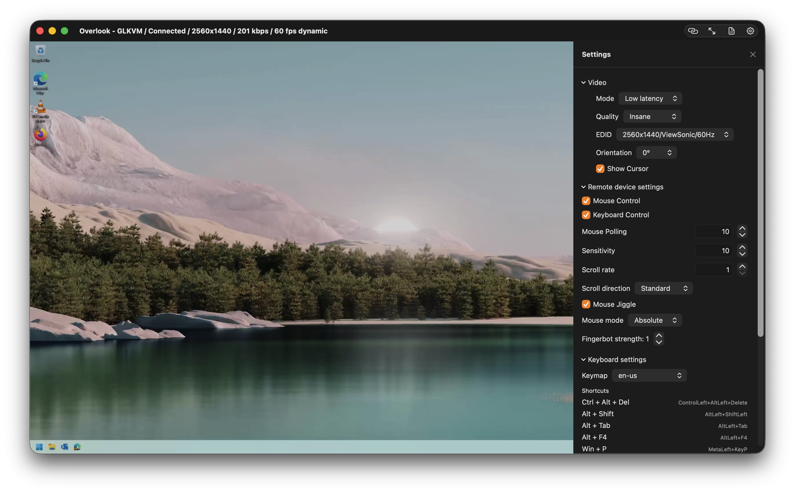

# Overlook

Overlook is a macOS-native remote console for GL.iNet GLKVM / Comet-style KVM devices.

It focuses on *fast*, *low-friction* day-to-day “reach over and fix it” workflows:

- Low-latency WebRTC video streaming (Janus signaling).
- Full keyboard + mouse input capture.
- **Clipboard bridging**:
  - **Local → Remote paste** with `⌘V` (types the clipboard into the remote machine).
  - **Remote → Local copy via ML OCR**: select text directly from the live video stream using Apple Vision and copy it to your Mac clipboard.

If you spend time in BIOS/UEFI, bootloaders, headless servers, or “the machine that’s *just* out of reach”, Overlook aims to make the remote console feel like a first-class Mac app.

---

## Highlights

### 1) Copy from the remote screen using ML OCR

Overlook includes an **OCR Selection Mode** that behaves like “Live Text” for a remote computer:

- Turn on OCR mode.
- Drag a box on the video stream.
- Overlook runs on-device OCR (Apple Vision framework), shows the recognized text, and you can copy it to your clipboard.

This is especially useful for:

- Capturing one-time passwords, serial numbers, IPs, MAC addresses.
- Copying terminal output from machines with no clipboard integration.
- Copying text in pre-boot environments.

**Note:** OCR is performed locally on your Mac.

### 2) Paste to the remote machine with `⌘V`

Overlook intercepts `⌘V` while input capture is enabled and sends the macOS clipboard to the remote via the device’s HID “print text” API.

This replaces the old “Paste to Remote” settings UI: the workflow is now the shortcut you already expect.

### 3) Low-latency WebRTC video

Overlook uses WebRTC for streaming and collects receiver stats (bitrate, fps, jitter buffer / playout delay, decode time, packet loss, ICE RTT).

These stats are surfaced in the window title, which makes diagnosing latency issues and tuning quality settings much easier.

### 4) A focused Settings panel (WebUI-aligned)

The Settings UI is intentionally aligned with GLKVM’s WebUI behavior where it matters:

- **Video quality presets** (Low/Medium/High/Ultra-high/Insane/Custom).
- **EDID** selection and custom EDID entry.
- Audio + microphone toggles (reconnect required).

---

## What devices are supported?

Overlook is built around GL.iNet’s GLKVM/Comet HTTP + WebRTC stack.

In code, devices are modeled as `KVMDevice` and discovered/managed by `KVMDeviceManager`.

If you have:

- GL.iNet Comet / GLKVM
- A GLKVM-compatible device exposing Janus signaling at `wss://<host>:<port>/janus/ws`

…Overlook is intended to work.

For now, it's only designed for local network use or direct IP connections (e.g. over VPN).

---

## Installation

### Requirements

- macOS 14+ (deployment target in project is macOS 14.0).
- Xcode (use the repository’s `Overlook.xcodeproj`).
- Network access to your KVM device.

### WebRTC dependency

Overlook uses the Swift Package:

- `https://github.com/stasel/WebRTC` (pinned in `Package.resolved`)

### Build

1. Open `Overlook.xcodeproj` in Xcode.
2. Select the `Overlook` scheme.
3. Build + Run.

---

## Quick Start (How to use Overlook)

### 1) Discover or add a device

Overlook supports multiple discovery methods (mDNS + network scanning + common target probes) and also manual entry.

From the main window:

- Click **Scan** to search your network.
- Or click **Manual Connect…** to enter host/IP and port.

From the menu bar:

- Use the Overlook status item to scan and connect quickly.

### 2) Connect

Select a device, then connect.

On connect, Overlook will:

- Authenticate to the device API (cookie token).
- Enable HID on the device.
- Start WebRTC streaming.
- Start keyboard/mouse capture.

If authentication fails, you’ll be prompted for a password and Overlook will attempt a login.

### 3) Control the remote machine

Once connected:

- Mouse movement, clicks, dragging, and scroll are forwarded.
- Keyboard is captured and forwarded.
- Standard UX flows like fullscreen work well for “monitor replacement” usage.

---

## OCR Copy Mode (Remote → Local)

### Enable OCR mode

You can enable OCR mode from:

- The main toolbar button (document/text icon).
- The fullscreen hover controls.
- The menu bar item (also supports a global shortcut).

When OCR mode is enabled:

- Overlook captures video frames from the WebRTC stream.
- It periodically detects text regions and overlays bounding boxes.

### Select text

OCR selection supports two gestures:

- **Click:** OCR a small region around the click point.
- **Drag a rectangle:** OCR the selected region.

Overlook then shows a “Recognized Text” sheet where you can:

- Copy the recognized text to your macOS clipboard.
- Close the sheet.

### Notes / limitations

- OCR accuracy depends on resolution, compression, font size, and contrast.
- OCR is currently tuned for English but uses automatic language detection.
- OCR works even when the remote machine has no clipboard support.

---

## Clipboard Paste (Local → Remote)

### Paste with `⌘V`

When connected and input capture is active:

- Press `⌘V` on your Mac.
- Overlook reads your macOS clipboard and sends it to the remote machine via the device’s HID text entry API.

This is ideal for:

- Commands
- URLs
- Password manager output (use responsibly)
- Small scripts / config snippets

### Tips

- If you paste a very large block of text, the remote side may take time to process.
- For best reliability, paste smaller chunks when interacting with BIOS/UEFI or slow boot environments.

---

## Keyboard shortcuts

Overlook includes a few “quality of life” shortcuts.

### In-session shortcuts (while keyboard capture is enabled)

- `⌘C`: toggles OCR selection mode (so you can “copy” from the remote screen).
- `⌘V`: pastes macOS clipboard to the remote.

### Menu bar global shortcuts

The menu bar agent listens for global shortcuts using `⌘⇧` modifiers:

- `⌘⇧O`: Toggle OCR.
- `⌘⇧R`: Scan for devices.
- `⌘⇧V`: Open Quick Connect.

(These are intended as fast, “from anywhere” actions.)

---

## Settings

Overlook’s settings UI lives in `Overlook/WebUISettingsPanel.swift` and is designed to map closely to the GLKVM WebUI.

### Video

- **Mode**: video processing mode (low-latency oriented).
- **Quality Presets**:
  - Low: `h264_bitrate=500`, `h264_gop=30`, `stream_quality=0`
  - Medium: `h264_bitrate=2000`, `h264_gop=30`, `stream_quality=1`
  - High: `h264_bitrate=5000`, `h264_gop=60`, `stream_quality=2`
  - Ultra-high: `h264_bitrate=8000`, `h264_gop=60`, `stream_quality=3`
  - Insane: `quality=100`, `h264_bitrate=20000`, `h264_gop=60`, `stream_quality=3`
  - Custom: unlocks the advanced streamer controls

- **EDID**:
  - Pick from known-good EDID presets.
  - Or choose “Custom” and paste your own EDID blob.

### Audio

- Audio output toggle.
- Microphone toggle.

**Important:** the UI indicates reconnect is required for audio/mic changes.

---

## Troubleshooting

### “I can’t find my device when scanning”

- Make sure your Mac is on the same network as the KVM.
- Try **Manual Connect…** with the host/IP and port.
- Some networks block mDNS; Overlook also does a best-effort port scan and probes common targets.

### “WebRTC connects but video is blank / unstable”

- Confirm the device’s WebUI works.
- Try toggling reconnect.
- Check the window title stats (bitrate/fps) to confirm frames are arriving.

### “OCR doesn’t detect text”

- Increase stream quality (higher bitrate helps OCR).
- Make the text larger on the remote side.
- Avoid heavy compression artifacts (try High/Ultra-high/Insane).

### “Paste doesn’t work”

- Ensure you’re connected.
- Ensure input capture is active.
- Confirm the remote cursor focuses a text field.

---

## Development notes

### Project structure

- `Overlook/ContentView.swift`
  - Main app UI and fullscreen experience.
- `Overlook/VideoSurfaceView.swift`
  - Hosts the WebRTC video view.
  - Routes mouse/scroll events.
  - Implements OCR selection gestures.
- `Overlook/WebRTCManager.swift`
  - WebRTC peer connection + Janus signaling.
  - Receiver stats collection.
  - Optional audio/mic track.
- `Overlook/InputManager.swift`
  - Keyboard/mouse capture.
  - Local→remote paste (`⌘V`).
  - HID transport via WebSocket to the device.
- `Overlook/OCRManager.swift` + `Overlook/OCRViews.swift`
  - Apple Vision OCR pipeline.
  - Text region overlay + “Recognized Text” sheet.
- `Overlook/GLKVMClient.swift`
  - Device HTTP APIs (streamer params, system config, EDID, HID print, etc.).
- `Overlook/KVMDeviceManager.swift`
  - Discovery, saved devices, authentication.
- `Overlook/MenuBarAgent.swift`
  - Menu bar UI + quick actions.

### Security notes

- The app currently allows insecure TLS for device connections (useful for devices with self-signed certs).
- Treat your `auth_token` like a password.

---

## License

This project is licensed under the **GNU General Public License v3.0**.

See [`LICENSE.md`](./LICENSE.md).
